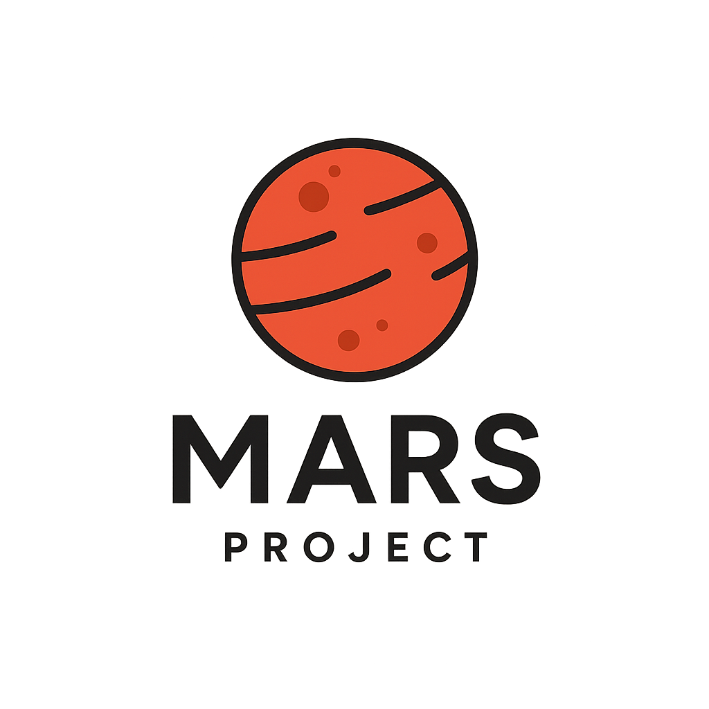

# 🚀 RedDust Reclaimer


**Synthetic Biology Meets Astrobiology**  
**RedDust Reclaimer** is a modular space biotech initiative that engineers *Bacillus subtilis* for perchlorate bioremediation under Martian regolith conditions. This project fuses multi-layered gene optimization, protein docking, metabolic modeling, and planetary bioethics — tracked at our GitHub project board:

📌 **Project Board**: [github.com/users/Jonahnki/projects/2](https://github.com/users/Jonahnki/projects/2)

---

## 🌌 Overview

Martian soil contains toxic perchlorates that threaten future habitability. This project aims to mitigate that risk using engineered *B. subtilis* expressing codon-optimized **perchlorate reductase (pcrA/pcrB)** and **chlorite dismutase (cld)** enzymes.

We integrate:

- 🧬 Codon optimization for high expression in *B. subtilis*
- 🔧 CRISPR/plasmid-based genome engineering
- ⚛️ Structural docking with AMDock & SwissDock
- 🧫 In silico metabolic modeling (COBRApy) under Mars constraints
- 🛰️ Space biosafety alignment with NASA and iGEM guidelines

---

## 🔬 Full Workflow Breakdown

### 🧪 Step 1: Gene Selection & Optimization
- Identify optimal **pcrA/pcrB** and **cld** genes.
- Codon-optimize for *B. subtilis* using tools like JCat and GeneOptimizer.
- Add regulatory elements (promoters, RBS, terminators).

**Tools**: NCBI, UniProt, KEGG, JGI IMG, JCat, Benchling  
**Output**: Synthesized, Mars-ready gene cassettes.

---

### 🧫 Step 2: Metabolic Pathway Modeling
- Integrate perchlorate detox pathway into *B. subtilis* metabolic network.
- Simulate Mars-like metabolism using COBRApy.

**Tools**: COBRApy, BioCyc, KBase  
**Output**: Simulated degradation flux map under Martian stressors.

---

### ⚛️ Step 3: Structural Enzyme Validation
- Dock enzymes with perchlorate/chlorite in AMDock & SwissDock.
- Run molecular dynamics (GROMACS) to confirm cold-environment stability.

**Tools**: PyMOL, SwissDock, AMDock, AutoDock Vina, GROMACS  
**Output**: Structurally stable enzyme designs for Mars.

---

### 🧬 Step 4: Genetic Engineering
- Design plasmids or apply CRISPR editing for chromosomal integration.
- Use strong constitutive promoters (e.g., Pspac, Pveg).

**Tools**: Benchling, SnapGene, CHOPCHOP, Geneious  
**Output**: Biocircuit constructs or edited *B. subtilis* genomes.

---

### 🧪 Step 5: Functional Verification 
- Perform RNA-Seq and WGS to confirm expression and stability.
- Check for off-target effects or mutations.

**Tools**: Galaxy, CLC Genomics Workbench, DESeq2  
**Output**: Omics-based validation of functional construct.

---

### 📊 Step 6: Predictive Mars Simulations
- Model system performance in low-pressure, low-temperature environments.
- Train ML models to optimize strain robustness and efficiency.

**Tools**: SciPy, Scikit-learn, TensorFlow, MATLAB  
**Output**: ML-tuned performance projections under Martian constraints.

---

### 🛰️ Step 7: Bioethics & Planetary Biosafety
- Align project with NASA's Planetary Protection guidelines.
- Address biosafety, dual-use risks, and off-Earth release protocols.

**Resources**: NASA Bioethics Policies, iGEM Safety Hub, Space SynBio frameworks  
**Output**: Compliance reports and ethical deployment pathway.

---

## ✅ Summary Table: Tools by Workflow Step

| Step | Category               | Tools & Resources                                                                 |
|------|------------------------|------------------------------------------------------------------------------------|
| 1    | Gene Optimization      | NCBI, UniProt, KEGG, JCat, Benchling                                              |
| 2    | Pathway Modeling       | COBRApy, KBase, BioCyc                                                            |
| 3    | Enzyme Engineering     | AMDock, SwissDock, AutoDock Vina, GROMACS, PyMOL                                 |
| 4    | Genome Engineering     | SnapGene, Benchling, CHOPCHOP, Geneious                                           |
| 5    | Expression Validation  | Galaxy, CLC Genomics, DESeq2                                                      |
| 6    | Predictive Modeling    | SciPy, NumPy, scikit-learn, TensorFlow, MATLAB                                    |
| 7    | Ethics & Safety        | NASA Guidelines, iGEM Safety Hub, Space Synthetic Biology Policy Documents        |

---

## 📦 Download & Setup

> 🔗 **Direct ZIP**: [Download RedDust Reclaimer](https://github.com/Jonahnki/reddust-reclaimer/archive/refs/heads/main.zip)  
> 📁 Project Board: [github.com/users/Jonahnki/projects/2](https://github.com/users/Jonahnki/projects/2)

### Clone This Repository
```bash
git clone https://github.com/Jonahnki/reddust-reclaimer.git
cd reddust-reclaimer

